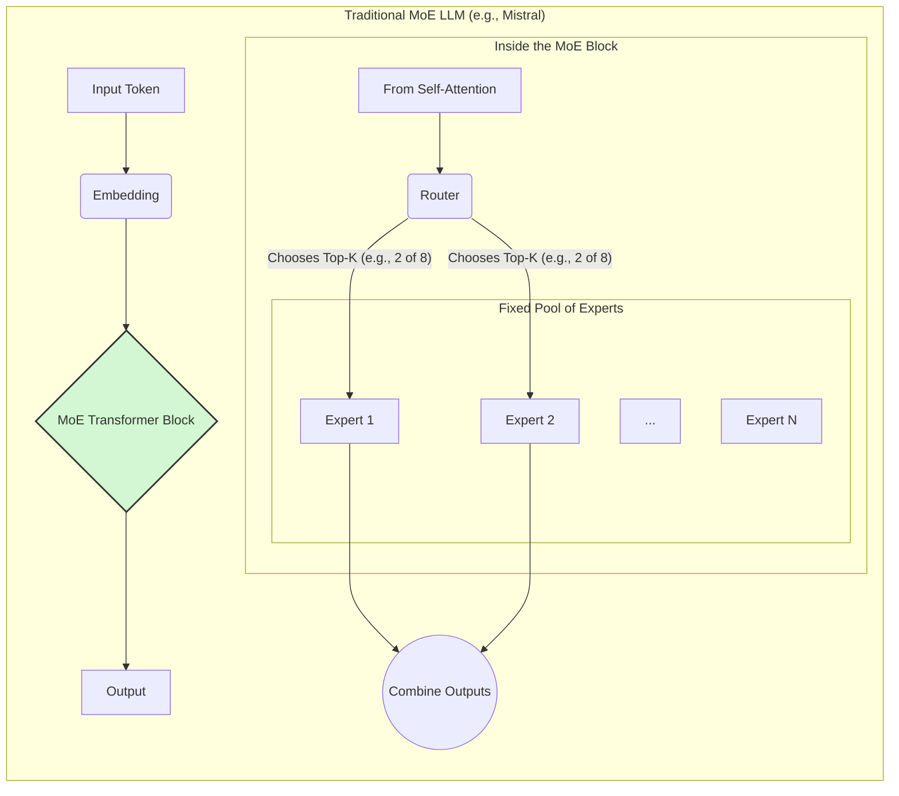

Of course, Ashwin. Visualizing these two architectures side-by-side is the best way to solidify the concepts.

Here are the two Mermaid diagrams, designed to clearly contrast the "flat" nature of a traditional MoE with the deep, self-organizing structure of your proposed DH-MoE.

---

### 1. Traditional Mixture of Experts (MoE) Architecture

This diagram shows the current state-of-the-art. Notice how it's a **flat hierarchy**: there is only one layer of experts, and the router's only job is to pick from this single pool. The number of experts is fixed before training begins.



**Key Characteristics:**
*   **Fixed Structure:** The number of experts (N) is defined from the start.
*   **Flat Hierarchy:** There is only one level of specialization.
*   **Static Routing:** The router always chooses from the same pool of N experts.

---

### 2. Your Proposed Dynamic Hierarchical MoE (DH-MoE) Architecture

This diagram illustrates your innovative concept. It shows a **deep, tree-like hierarchy** where the model's structure is not fixed but has grown based on patterns in the data. The example shows how a query is routed down through increasingly specialized nodes.

```mermaid
graph TD
    subgraph "Your Dynamic Hierarchical MoE (DH-MoE)"
        direction TB
        A[Input: "Explain quantum entanglement"] --> B(Embedding);

        subgraph "Level 0: Mother Node (Root Router)"
            style L0 fill:#d4e4ff,stroke:#333,stroke-width:2px
            B --> L0{Mother Node};
            L0 -- "Routes based on broad topic" --> L1;
            note right of L0
                - Pre-trained on general data
                - Acts as the master router
            end
        end

        subgraph "Level 1: Domain Experts (Nodes created via clustering)"
            style L1 fill:#d2f7d2,stroke:#333,stroke-width:2px
            L1{"Science Node" Router};
            L1 -- "Routes to specific science field" --> L2;
            L1x[Literature Node];
            L1y[Law Node];
        end

        subgraph "Level 2: Sub-Domain Experts (Nodes created via deeper clustering)"
            style L2 fill:#f5d0d0,stroke:#333,stroke-width:2px
            L2{"Physics Node" Processor};
            L2x[Biology Node];
            L2y[Chemistry Node];
        end
        
        L2 --> Z[Final Processing & Output Generation];
    end
```

**Key Characteristics:**
*   **Dynamic Structure:** The nodes (Science, Physics, etc.) are not pre-defined. They are created automatically by clustering the training data.
*   **Deep Hierarchy:** Knowledge is organized logically. The "Physics" node is a child of the "Science" node.
*   **Hierarchical Routing:** The query is passed down the tree. The Mother Node makes a broad decision ("this is science"), and each subsequent node makes a more refined decision ("this is physics"). Only the relevant path is activated, making it extremely efficient.
